# LAB4 WEB

<table border="2" cellpading="10">
  <tr>
    <td><b>Nama</b></td>
    <td>Ilham Nur Utomo</td>
  </tr>
  <tr>
    <td><b>NIM</b></td>
    <td>312010129</td>
  </tr>
  <tr>
    <td><b>Kelas</b></td>
    <td>TI.20.A1</td>
  </tr>
  <tr>
    <td><b>MataKuliah</b></td>
    <td>Pemrograman Web</td>
  </tr>
</table>

# <b>Praktikum</b>

## <b>1. Box Element </b>
- Dengan internal css, <i>float property</i>
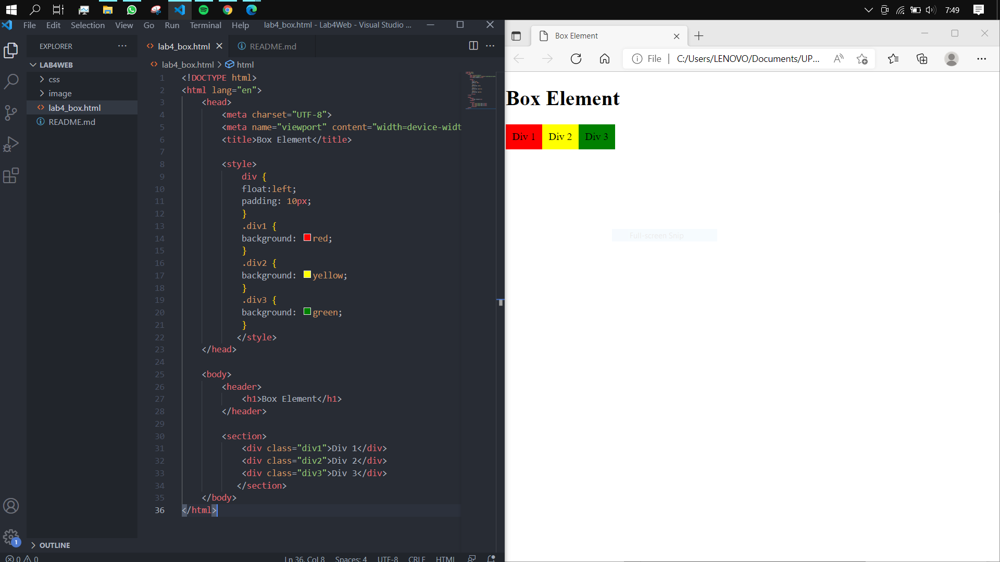

## <b>2. Clearfix Element </b>
- Properti ``clear: left;`` pada ``div4``
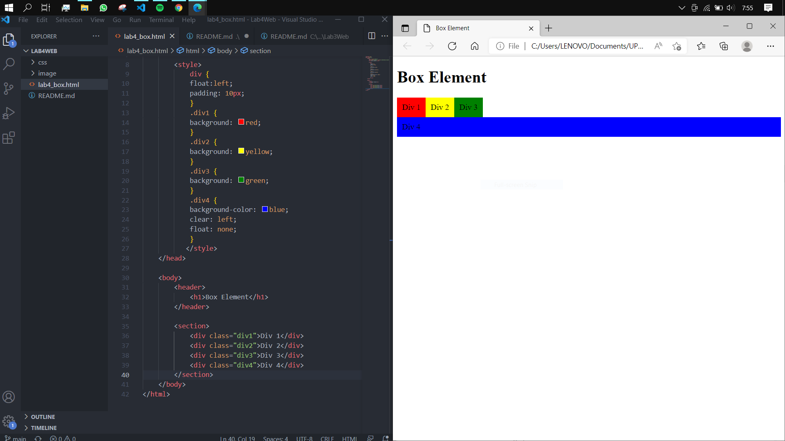 

- Box Merah berada di kiri
- Properti ``clear: right;`` Box Hijau berada di kanan
- Properti ``clear: both;`` Box Kuning berada di antara Box Merah dan Box Hijau
- Properti ``clear: left;`` Box biru berada di kiri.

## <b>3. Kerangka Layout </b>
- File baru, ``lab4_layout.html`` dengan css eksternal ``css/style.css``.
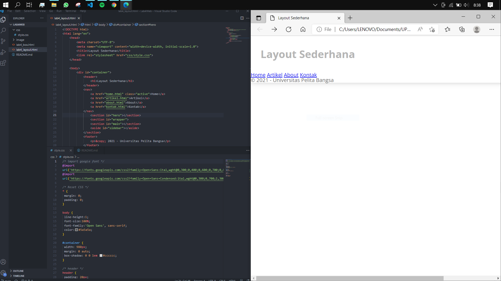

## <b>4. Menu Navigasi </b>
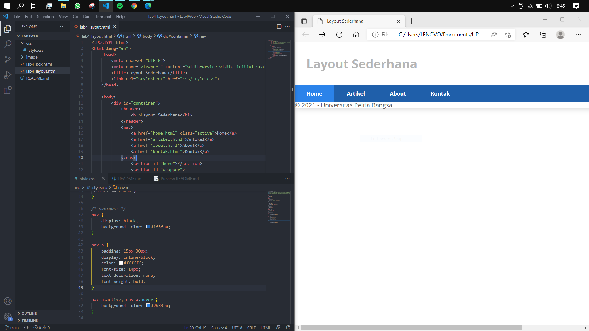

## <b>5. Hero Panel </b>
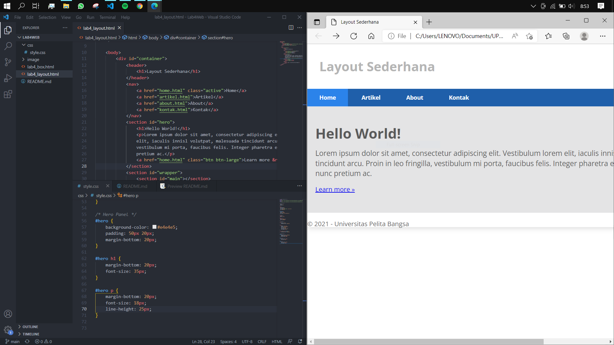

## <b>6. Layout Main dan Sidebar </b>
- Sidebar widget, dengan zoom in microsoft edge 67%
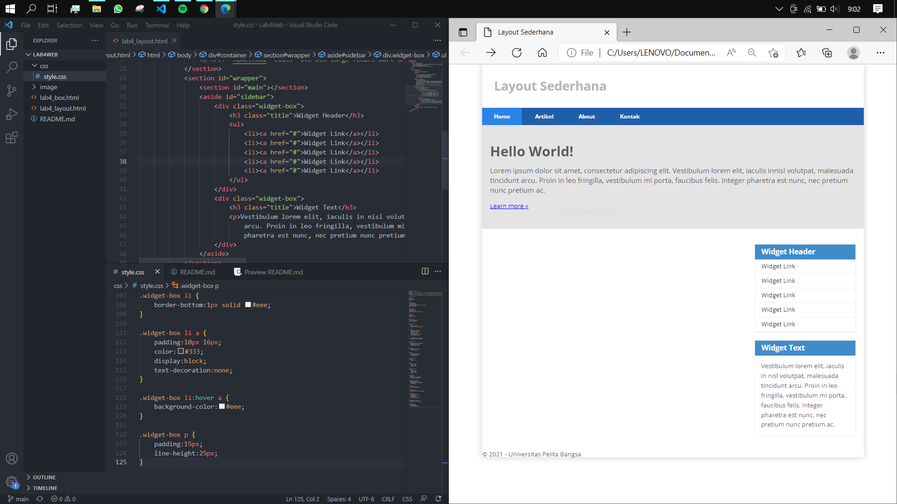

## <b>7. Footer </b>
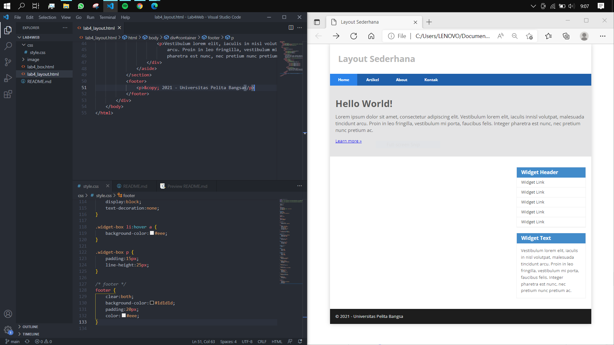

## <b>8. Main Content </b>
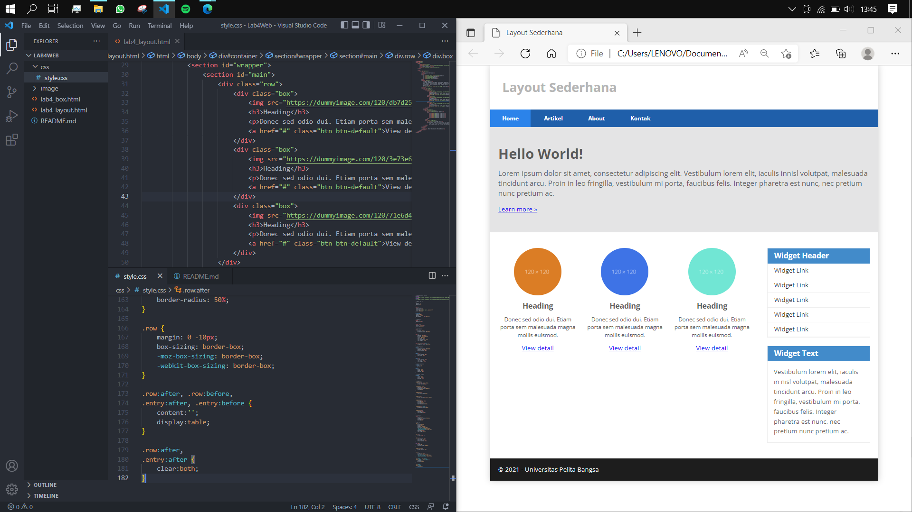

## <b>9. Konten Artikel </b>
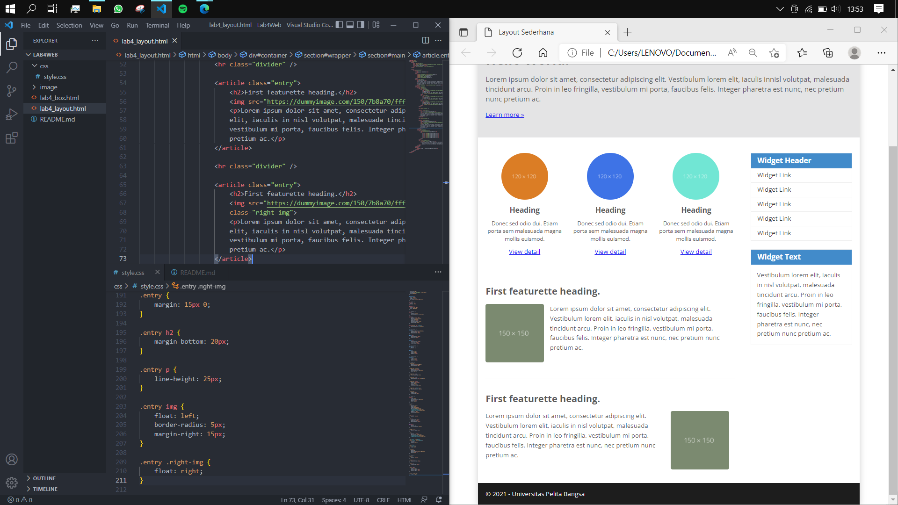

# Tugas

- <b>1. Tambahkan Layout untuk menu About => buat single layout yang berisi deskripsi, portfolio, dll<b>
  - Jawaban:
  
  - Berikut isi dari ``
 id="about">``.
  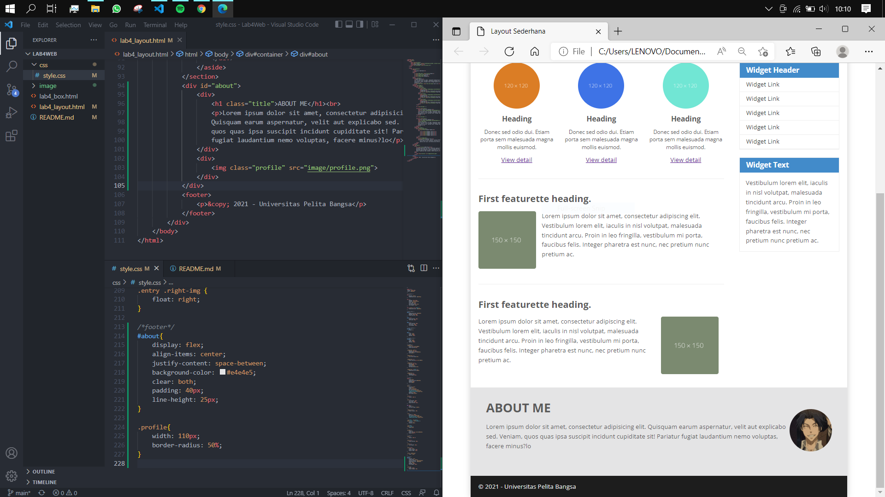 

  - ``display: flex;`` berfungsi membuat elemen-elemen yang ada di dalamnya menjadi menjajar ke samping dengan rapih (sesuai keinginan).
  - ``align-items: center`` agar semua item di dalam flex berada di tengah.
  - ``justify-content: space-between;``untuk memberi jarak antar kontennya. 

- <b>2. Tambahkan layout untuk menu Contact => yang berisi form isian: nama, email, message, dll</b>
  - Jawaban:

  - Sebelum,
  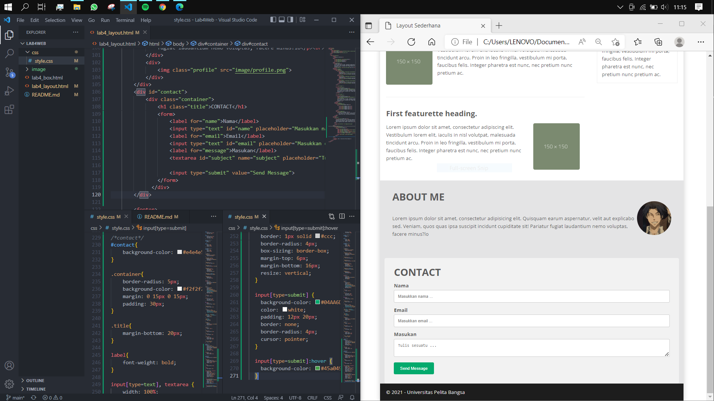 
  - Sesudah, proses klik <i>Send Message</i>
  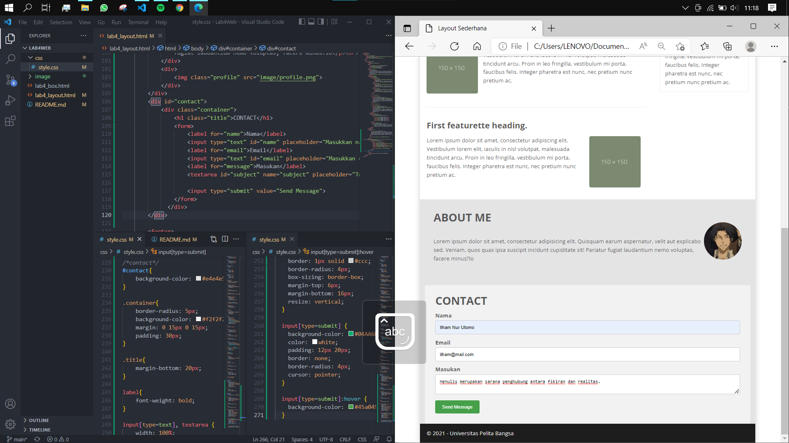 

  - Pada ``input[type=text], textarea``, ``resize: vertical;`` berfungsi mengatur kolom <b>Masukan</b> agar hanya dapat naik-turun.
  - ``input[type=submit]:hover`` adalah ketika kursor diarahkan ke elemen tersebut, maka akan berubah sesuai pengkondisiannya.
