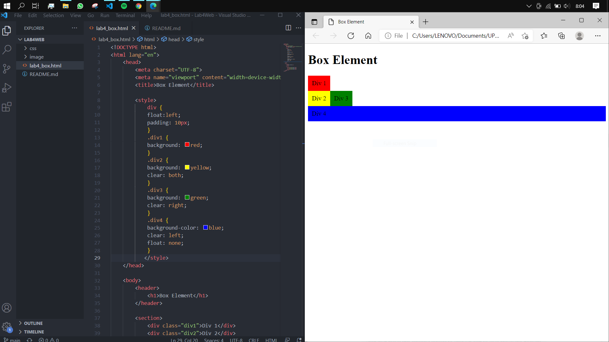

# LAB4 WEB

<table border="2" cellpading="10">
  <tr>
    <td><b>Nama</b></td>
    <td>Ilham Nur Utomo</td>
  </tr>
  <tr>
    <td><b>NIM</b></td>
    <td>312010129</td>
  </tr>
  <tr>
    <td><b>Kelas</b></td>
    <td>TI.20.A1</td>
  </tr>
  <tr>
    <td><b>MataKuliah</b></td>
    <td>Pemrograman Web</td>
  </tr>
</table>

# <b>Praktikum</b>

## <b>1. Box Element </b>
- Dengan internal css, <i>float property</i>

## <b>2. Clearfix Element </b>
- Properti ``clear: left;`` pada ``div4``
 

- Box Merah berada di kiri
- Properti ``clear: right;`` Box Hijau berada di kanan
- Properti ``clear: both;`` Box Kuning berada di antara Box Merah dan Box Hijau
- Properti ``clear: left;`` Box biru berada di kiri.

## <b>3. Kerangka Layout </b>
- File baru, ``lab4_layout.html`` dengan css eksternal ``css/style.css``.

## <b>4. Menu Navigasi </b>

## <b>5. Hero Panel </b>

## <b>6. Layout Main dan Sidebar </b>
- Sidebar widget, dengan zoom in microsoft edge 67%

## <b>7. Footer </b>

## <b>8. Main Content </b>

## <b>9. Konten Artikel </b>
